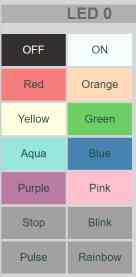

[English version](https://madnerdorg.github.io/leds/)

[](https://madnerdorg.github.io/libreconnect/doc/fr/devices)     
[Télécharger Leds](https://github.com/madnerdorg/leds/archive/master.zip) /  [LibreConnect](https://madnerdorg.github.io/libreconnect/) /[Source](https://github.com/madnerdorg/leds)

   
**leds** permet de contrôler 1 ou plusieurs LEDS (ws2812b).    
Vous pouvez changer les couleurs en utilisant les couleurs HSV ainsi que  animer chaque leds indépendamment.    
Une fois que vous êtes satisfait de l'apparence de vos leds, sauvez le résultat dans la mémoire (eeprom) de l'arduino.    

- [Applications](#applications)
- [Comment construire leds](#comment-construire-leds)
- [Commandes disponibles](#commandes-disponibles)

# Applications
## [apps/html](http://madnerd.org/interface/leds2_fr.html)
Paramètrer vos leds à l'aide d'une page web, une fois que vous satisfait de la manière dont vos leds brillent, vous
pouvez sauvegarder l'état et l'arduino se souviendra de l'état actuel.
Vous pouvez ainsi l'utiliser n'importe où!    
   

## [apps/tasker](https://github.com/madnerdorg/leds/tree/master/apps/tasker) 
Soyez notifier quand quelqu'un vous appelle, grâce à tasker à l'aide de scripts tout simple en javascript.
Grâce à la puissance de [tasker](https://play.google.com/store/apps/details?id=net.dinglisch.android.taskerm), vous pouvez allumer vos leds lorsqu'il se passe des choses sur votre téléphone!

Vous pouvez aussi utiliser [Power Toggles](https://play.google.com/store/apps/details?id=com.painless.pc) pour créer vos propres boutons dans la barre de notifications.

Voici un script que j'utilise pour éteindre mes leds
* Créer une tâche
* Importer le code à l'aide de Code/Javascript
* Retirer auto exit (sortie auto)
* Mettre le délai à 1 seconde.

```
ip="192.168.0.140";
port=42001;


bluepulse = "load;255;160;255;143;2;0;0;160;255;116;2;0;0;";
police = "load;255;0;255;255;4;0;1;160;255;255;4;1;70;";
fire = "load;123;32;255;41;2;0;0;32;255;129;2;0;0;";
off = "/off";

leds = new WebSocket("ws://"+ip+":"+port);
leds.onopen = send;

function send(){
	leds.send(off);
}
```

## apps/thunderbird   
Soyez notifier quand quelqu'un vous envoie un email, à l'aide des **filtres** et du plugin [mail alerts](https://addons.mozilla.org/fr/thunderbird/addon/mailbox-alert/).

Vous pouvez utiliser [ws-send](https://github.com/madnerdorg/libreconnect/blob/master/ws-send.py) pour contrôler vos leds
```
"c:\libreconnect\ws-send.exe" -u "ws://localhost:42001" -m "/on"
```

# Comment construire leds

## Arduino
Tout d'abord nous devons copier le code sur un arduino,
* Copier **arduino/leds** et **arduino/library** dans votre carnet de croquis arduino
* Téléverser **leds/leds.ino**

## Composants
Voici la liste des composants , vous pouvez facilement les trouvers sur ebay/aliexpress grâce à ses mots-clés.
### led2
* RobotDyn Nano V3 (micro-usb): 2€
### led5
* Arduino nano clone CH340G (mini-usb): 2€
### Strip WS2812B
* 30 leds WS2812B : 4.50€ ( 5 leds :0.75€)
* Resistor pack 400pcs (3€) (1 resistor: 0.0071€)
* Total : 9.5€ (2.75€)

## Branchement


### Attention!
Evitez d'utiliser plus de 5 LEDS sans une alimentation dédié, où vous risquez d'abimer vos LEDS.
Chaque leds consomme à peu près **60ma** lorsqu'elle sont complètement allumée
Source:
https://learn.adafruit.com/adafruit-neopixel-uberguide/basic-connections

* D6 --> RESISTANCE (470Ohm) DI
* +5V --> 5V
* GND --> GND

# Impression 3D
Afin d'avoir une lumière uniforme, vous pouvez utiliser un boitier semi-transparent en plus du boitier.

    
[Modèles](https://github.com/madnerdorg/leds/tree/master/stl)

# Commandes disponibles
Voici les commandes disponibles, vous pouvez les envoyer en utilisant le logiciel Arduino (baudrate 115200)

## Commandes globales
* /info -------> Donne le nom de l'appareil (nom:port) (leds:42001)
* /off --> Eteint toutes les leds
* /on --> Allume toutes les leds
* /status --> Affiche l'état des leds sous cette forme: general_brightness;led0;hue;saturation;value;type_animation;arg1;arg2 etc...
* /load;[status] --> Charge un état des leds (attention, le buffer série n'est pas assez performant pour gérer 5 leds)
* /save --> Sauvegarde l'état actuel des leds dans la mémoire de l'arduino (eeprom)
* /reset --> Remet l'état à celui sauvegrder dans l'eeprom
* /sync --> Change value à 255 (luminosité à fond), ceci a pour effet de resynchroniser chaque animations pour les leds.
* /clear --> Efface l'état des leds sauvegarder dans l'eeprom.

### Example pour load
```
 Fire: load;123;32;255;41;2;0;0;32;255;129;2;0;0;
```
## Commandes pour une led
```
color;led;Hue;Saturation;Value ---> Change la couleur pour une led
animation;led;type;arg1;arg2 ---> Change l'animation pour une led
```
## Couleur (hue)
Les couleurs exprimés en HSV ont trois paramètres: hue(couleur), saturation(plus ou moins blanc), value(luminosité)
La valeur la plus important est le **hue** car elle définit la couleur, à l'exception du blanc (qui utilise la saturation à 0), vous pouvez
pratiquement mettre uniquement 255;255 pour value et saturation.
* rouge = 0
* orange = 32
* jaune = 64
* vert = 96
* aqua = 128
* bleu = 160
* violet = 192
* rose = 224       

### led0 en red 
```
color;0;0;255;255
```
# Animation

  
*  0: Pas d'animation
*  1: Clignotement (param1:vitesse en ms)
*  2: Pulsation
*  3: Mode arc-en-ciel
*  4: Clignotement alterné (param1:0:maitre/1:esclave, param2:position led esclave/vitesse en ms)

## led 0 pulsation
```
animation;2;0;0
```
## led 1 clignotement à 25ms
```
animation;1;25;0
```
## led 2 mode arc en ciel (change hue)
```
animation;3;0;0
```
# 

# Licences

## leds.ino
* Auteur: Rémi Sarrailh (madnerd.org)   
* Licence: MIT

## FastLed
* Auteur principale: Daniel Garcia (fastled)
* Licence: MIT
* Link : https://github.com/FastLED/FastLED

## Boitier (stl)
* Auteur: Olivier Sarrailh
* Licence: CC-by
