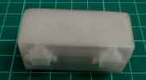
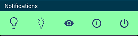
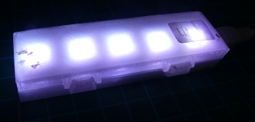

[Français](https://madnerdorg.github.io/leds/readme.fr)

[](https://madnerdorg.github.io/libreconnect/doc/en/devices)   
[Download Leds](https://github.com/madnerdorg/leds/archive/master.zip) /  [LibreConnect](https://madnerdorg.github.io/libreconnect/) /[Source](https://github.com/madnerdorg/leds)

   
**leds** is a device to control 1 or more leds (ws2812b) using USB.   
You can animate each leds independently, and change the color using **hsv colors**.  

- [Applications](#applications)
- [How to build leds](#how-to-build-leds)
- [Commands](#commands)

# Applications
> By default , leds are available at ws://localhost:42001

## [apps/html](http://madnerd.org/interface/leds2)  
Control your leds using a webpage    
   

## [apps/tasker](https://github.com/madnerdorg/leds/tree/master/apps/tasker)    
   
Be notified when someone calls you, using [tasker](https://play.google.com/store/apps/details?id=net.dinglisch.android.taskerm) and some easy to use JavaScript.
You can trigger leds for any events that happens on your phone!

You can also use [Power Toggles](https://play.google.com/store/apps/details?id=com.painless.pc) to make buttons on your notification bar.



Here is a script I use to turn off leds.
* Create a task
* Import your code using Code/Javascript
* Remove auto exit
* Delay set to 1 seconds.

```
ip="192.168.0.140";
port=42001;


bluepulse = "load;255;160;255;143;2;0;0;160;255;116;2;0;0;";
police = "load;255;0;255;255;4;0;1;160;255;255;4;1;70;";
fire = "load;123;32;255;41;2;0;0;32;255;129;2;0;0;";
off = "/off";

leds = new WebSocket("ws://"+ip+":"+port);
leds.onopen = send;

function send(){
	leds.send(off);
}
```

## apps/thunderbird    
Be notified when someone sends you an email, using **filters** and [mail alerts](https://addons.mozilla.org/fr/thunderbird/addon/mailbox-alert/) plugin.

You can use [ws-send](https://github.com/madnerdorg/libreconnect/blob/master/ws-send.py) to control leds.
```
"c:\libreconnect\ws-send.exe" -u "ws://localhost:42001" -m "/on"
```


# How to build leds

## Arduino
First we need to copy the code on an arduino, 
* Copy **arduino/leds** and **arduino/library** into your arduino sketchbook
* Upload **leds/leds.ino**

## Components
Here is the list of components, you will need you can easily find it using these keywords on ebay/aliexpress etc...
### led2
* RobotDyn Nano V3 (micro-usb): 2€
### led5
* Arduino nano clone CH340G (mini-usb): 2€
### Strip WS2812B
* 30 leds WS2812B : 4.50€ ( 5 leds :0.75€)
* Resistor pack 400pcs (3€) (1 resistor: 0.0071€)
* Total : 9.5€ (2.75€)

## Wiring


* D6 --> RESISTOR (470Ω) DI
* +5V --> 5V
* GND --> GND

### Warning
Do not used more than 5 LEDs without a dedicated power supply or this can damage the LEDs, 
Each led can draw up to **60ma** at full brightness   
Arduino can provide up to **500ma** (on 5v/Gnd pin)   
```5 LEDs = 5x60ma = 300ma ```  
Source:
[https://learn.adafruit.com/adafruit-neopixel-uberguide/basic-connections]()

# 3D printing
You will have a more uniform light, if you put the case inside another semi-transparent case.    

    
[Models](https://github.com/madnerdorg/leds/tree/master/stl)

# Commands
Here are the commands available, you can send it using Arduino at baudrate 115200.

## Global commands
* /info -------> Give name of device (name:port) (leds:42001)
* /off --> Turn off all leds
* /on --> Turn on all leds
* /status --> Display state of all leds as general_brightness;led0;hue;saturation;value;type_animation;arg1;arg2 etc...
* /load;[status] --> Load the state of leds/animation specified (warning this won't works with 5 leds as the string is too long for serial buffer)
* /save --> Save current state to eeprom
* /reset --> Reset state to eeprom state
* /sync --> Change all value to 255 (max brightness), this will synchronize blink/pulse animation for all leds
* /clear --> Remove settings in eeprom    

### Load example
```
 Fire: load;123;32;255;41;2;0;0;32;255;129;2;0;0;
```
## Leds specific commands
```
color;led;Hue;Saturation;Value ---> Change color for a specific led using hsv
animation;led;type;arg1;arg2 ---> Change animation for a specific led
```
# Color (hue)
Color is hsv have three parameters: hue(color),saturation(more or less white~),value(brightness)
The most important value in hsv is the **hue** which define the color, you can pretty much always use 255;255 for
saturation/value (with the exception of the white color which use 0 as saturation).
* red = 0
* orange = 32
* yellow = 64
* green = 96
* aqua = 128
* blue = 160
* purple = 192
* pink = 224       

## led0 in red 
```
color;0;0;255;255
```
# Animation

  
* 0: No animation
*  1: Blinking (param1:speed in ms)
*  2: Pulsing
*  3: Rainbow mode
*  4: Alternative Blink (param1:0:master/1:slave, param2:second led/speed in ms)

## led 0 pulsing
```
animation;2;0;0
```
## led 1 blinking at 25ms
```
animation;1;25;0
```
## led 2 rainbow mode (hue change)
```
animation;3;0;0
```
# 

# Licences

## leds.ino
* Author: Rémi Sarrailh (madnerd.org)   
* Licence: MIT

## FastLed
* Main author: Daniel Garcia (fastled)
* Licence: MIT
* Link : [https://github.com/FastLED/FastLED]()

## Cases (stl)
* Author: Olivier Sarrailh
* Licence: CC-by
